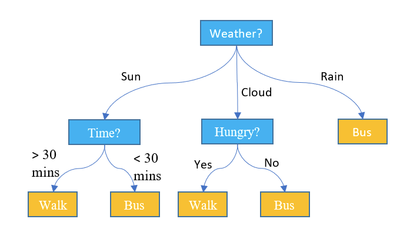
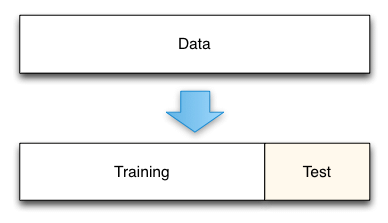

# Machine learning
* In this lecture, we' ll learn simple machine learning techniquies and how to do it in Python.

## Introduction
* Machine learning is about extracting knowledge from data. It is a research field at the intersection of statistics, artificial intelligence, and computer science and is also known as predictive analytics or statistical learning.

### Supervised and unsupervised learning
* Machine learning systems can be classified according to the amount and type of supervision they get during training.
* Major categories are **supervised learning**, and **unsupervised learning**.

<div align="center">

</div>

#### Supervised learning
* Machine learning algorithms that learn from input/output pairs are called **supervised learning** in the form of the desired outputs for each example that they learn from.
* In supervised learning, the training data you feed to the algorithm should include the desired solutions, called *labels*.
* A typical supervised learning task is *classification*. The spam filter is a good example of this: it is trained with many example e-mails along with their class (i.e. spam or non-spam), and it must learn how to classify new e-mails.
* Another typical task is *regression*, which predicts a target numeric value, such as the price of a car, given a set of features. To train the system, you need to give it many examples of cars, including both their features and their labels (i.e. their prices).

#### Unsupervised learning
* **Unsupervised learning** algorithms are the other type of algorithm. In unsupervised learning, only the input data is known, and no known output data is given to the algorithm. In unsupervised learning, the training data is unlabeled. The system tries to learn without a teacher.
* An example of unsupervised learning is *clustering*. For example, say you have a lot of data about your blog's visitors.

## Examples
### Regression
* Here we will study the regression procedure in scikit-learn library, using *diabetes dataset*.
* Description in scikit-learn document about this dataset: *"Ten baseline variables, age, sex, body mass index, average blood pressure, and six blood serum measurements were obtained for each of n = 442 diabetes patients, as well as the response of interest, a quantitative measure of disease progression one year after baseline."*

* Let's load the library and the dataset.
  ```python
  from sklearn import datasets
  diabetes = datasets.load_diabetes()
  print(diabetes["feature_names"])
  print(diabetes["target"])
  ```

* First, convert data in to Pandas DataFrame.
  ```python
  import matplotlib.pyplot as plt
  import numpy as np
  import pandas as pd

  dia = datasets.load_diabetes()
  X = pd.DataFrame(dia.data, columns=dia.feature_names)
  y = pd.DataFrame(dia.target, columns=["target"])
  df = pd.concat([X, y], axis=1)

  print(df.head())
  ```

* See the correlation heat map. This heat map shows the *correlation coefficient*, which measures the dependence of two variables.

$$
r_{xy} = \frac{\frac{1}{n}\sum_{i=1}^n \left( x_i - \bar{x} \right)\left( y_i - \bar{y} \right) }{\sqrt{\frac{1}{n}\sum_{i=1}^n \left(x_i - \bar{x} \right)^2}\sqrt{\frac{1}{n}\sum_{i=1}^n \left(y_i - \bar{y} \right)^2}}
$$

```python
corr = df.corr()
fig = plt.figure()
sns.heatmap(corr, vmin=-1, vmax=1, annot=True)
plt.show()
```

* Make a linear regression model with BMI (highest correlation coefficient) and the target value.
* We will measure the score by the *R2 (coefficient of determination)*.

$$
R^2 = 1 - \frac{\sum_{i=1}^n (y_i - y_{pred})^2}{\sum_{i=1}^n (y_i - \hat{y})^2}
$$

* Here $y_{pred}$ is the y-value predicted by the regression model and $\hat{y}$ is the average value of y.
  ```python
  from sklearn import datasets, linear_model
  from sklearn.metrics import r2_score

  x = df[["bmi"]]

  model = linear_model.LinearRegression()
  model.fit(x, y)
  y_pred = mode.predict(x)

  r2 = r2_score(y, y_pred)

  print(f"R2: {r2:.3f}")

  # plot
  plt.figure(figsize=(5, 5))
  plt.scatter(df["bmi"], df["target"])
  plt.plot(x_test, model.predict(x_test), color="red")
  plt.xlabel("bmi")
  plt.ylabel("target")
  plt.title("bmi vs target (Linear Regression)")
  plt.show()
  ```
* You can see the regression model was set by `model = linear_model.LinearRegression()`, which is a class.
* Then the class method `.fit` and `.predict` was used. These methods do the parameter fitting and making a prediction, respectively.
* This procedure is common to most of the scikit-learn classes. So, if you want to use other regression models, just replace the regression class.

## Classification
* Let's try to do the classification with scikit-learn.
* Classification algorithm tries to set a *decision boundary*, which divides the data into several classes.

<div align="center">

</div>

* A decision boundary need not to be a simple linear line.

### Iris dataset
* Here, we will use the *iris dataset*, which is a typical dataset for machine learning.

<div align="center">

</div>

```python
# Importing scikit-learn and loading a dataset
from sklearn import datasets

# Load a sample dataset (Iris dataset)
iris = datasets.load_iris()
print("Features:", iris.feature_names)
print("Target:", iris.target_names)
```

* The dataset has three species, *iris setosa*, *iris versicolor*, and *iris virginica*.
* The relationship between species and variables such as sepal length or width can be shown as follows.
  ```python
  from sklearn import datasets

  iris = datasets.load_iris()
  import matplotlib.pyplot as plt

  _, ax = plt.subplots()
  scatter = ax.scatter(iris.data[:, 0], iris.data[:, 1], c=iris.target)
  ax.set(xlabel=iris.feature_names[0], ylabel=iris.feature_names[1])

  plt.show()
  ```

### Decision tree classifier
* One of the basic classification algorithm is the *decision tree classifier*.
* It divides the data into several groups with some condition, and sub-divided data is further divided into groups, recursively.
<div align="center">

</div>

```python
from sklearn.datasets import load_iris
from sklearn import tree
from mlxtend.plotting import plot_decision_regions
import matplotlib.pyplot as plt
import numpy as np

iris = load_iris()
X, y = iris.data[:, 2:], iris.target
clf = tree.DecisionTreeClassifier()
clf = clf.fit(X, y)
tree.plot_tree(clf, filled=True)
plt.show()

fig, ax = plt.subplots(figsize=(7, 7))
plot_decision_regions(X, y, clf=clf)
plt.xlabel('petal length [cm]')
plt.ylabel('petal width [cm]')
plt.legend(loc='upper left')
plt.tight_layout()
plt.show()
```

# Unsupervised learning - clustering
* *Clustring* is dividing the whole data into several groups. This process doesn't need the label data, so this is unsupervised learning.
* K-means is one of the popular algorithm for clustering. It calculates the centroid of the clusters, and assign the cluster according to the distance from the centroid.

<div align="center">

</div>

* Here we divide the iris data into three groups with K-means.
  ```python
  from sklearn import datasets
  from sklearn.cluster import KMeans
  import matplotlib.pyplot as plt

  iris = datasets.load_iris()

  X = iris.data[:, :2]

  kmeans = KMeans(n_clusters=3)
  kmeans.fit(X)

  # Visualizing clusters
  plt.scatter(X[:, 0], X[:, 1], c=kmeans.labels_, cmap='viridis')
  plt.scatter(kmeans.cluster_centers_[:, 0], kmeans.cluster_centers_[:, 1], s=200, c='red', label='Centroids')
  plt.legend()
  plt.show()
  ```

## Train-test split
* Usually, it is better to split the whole data into *training data* and *test data*.
* The model parameter fitting with training data only tends to cause *overfitting*: the overfitted model has high accuracy only to a given training data, but poor accuracy for unseen data.
* Thus, evaluation of the accuracy should be done with unseen data. To do this, we split the data into training data and test data.

<div align="center">

</div>

* In scikit-learn, splitting the training and test data is done with `train_test_split` function.
  ```python
  from sklearn import datasets
  from sklearn.model_selection import train_test_split
  
  iris = datasets.load_iris()
  X = iris.data[:, 2:]
  y = iris.target
  
  X_train, X_test, y_train, y_test = train_test_split(X, y, test_size=0.1)
  
  print(f"total sample size: {len(X)}")
  print(f"training: {len(X_train)}, test: {len(X_test)}")
  ```

# Exercise
* Make the regression model of diabates with train-test split. Let's analyze the diabetes data again. Using "BMI" as the variable, try to regress the target variable.
1. Using same x and y in the diabetes regression, split these x and y into the training and test sets.
2. Do the regression, and measure the R2 score for training and test sets. What's the difference?
<a href="./answer.md#ml">answer</a>
