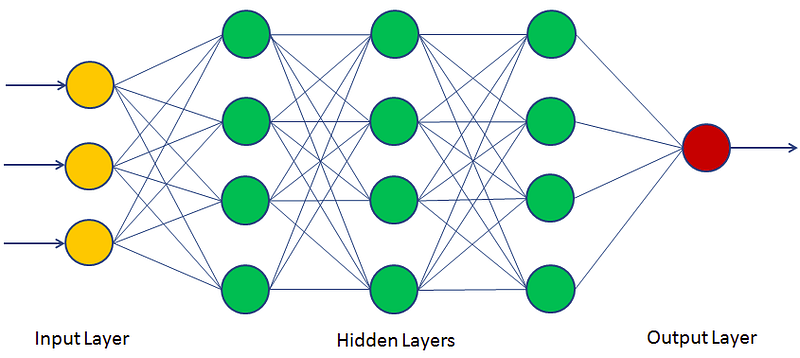

# Neural networks
* In this lecture, we will learn the basics of the neural network (NN).

## Perceptron
* The perceptron is one of the simplest artificial neural network (ANN) archtechtures.
* It is based on a artificial neuron called a linear threshold unit (LTU): the inputs and output are numbers and each input connection is associated with a weight $w$.
* The LTU computes a weighted sum of its inputs ($z = w_1x_1 + w_2x_2 + \cdots + w_n x_n = {\bf w}^T\cdot{\bf x}$), then applies a step function to sum and outputs the result: $h_w({\bf x}) = {\rm step}(z) = {\rm step}({\bf w}^T\cdot{\bf x})$.
* Common step function used in perceptrons are 
```math
\begin{align*}
{\rm heaviside}(z)= \left\{
    \begin{matrix}
        0 {\hspace 15pt}\text{if}{\hspace 5pt}z \lt 0 \\
        1 {\hspace 15pt}\text{if}{\hspace 5pt}z \ge 0
    \end{matrix}
\right.
\\
\\
{\rm sgn}(z)= \left\{
    \begin{matrix}
        -1 {\hspace 15pt}\text{if}{\hspace 5pt}z \lt 0 \\
         0 {\hspace 15pt}\text{if}{\hspace 5pt}z = 0 \\
         1 {\hspace 15pt}\text{if}{\hspace 5pt}z \gt 0
    \end{matrix}
\right.
\end{align*}
```

<div align=center>

</div>

* A single LTU can be used for simple linear binary classification. It computes a linear combination of the inputs and if the result exceeds a threshold. Otherwise it outputs the positive class or else outputs the negative class.
* For example, you can use a single LTU to classify iris flowers based on the petal length and width. Training an LTU means finding the right values for weights $w_0$, $w_1$, and $w_2$.

### Multi-layer perceptron
* An multi-layer perceptron (MLP) typically has a following architechture: one (passthrough) input layer, one or more layers of LTUs (called *hidden layers*), and one final layer of the LTUs (called the output layer).
* Every layer except the output layer includes a bias neuron and is fully connected to the next layer. When an ANN has two or more hidden layers, it is called a *deep neutral network*.

<div align=center>

</div>

### Backpropagation
* For many years, researchers struggled to find a way to train MLPs, without success. But in 1986, D. E. Rumelhart et al. published a groundbreaking article introducing the backpropagation training algorithm.
* For each training instance, the algorithm feeds it to the network and coumputes the output of every neuron in each consective layer.
* Then it measures the network's output error (i.e. the difference between the desired output and the actual output of the network). The error is measured by the *loss function*.
* It computes how much each neuron in the last hidden layer contributed to the output. Similarly, contributions to the output from neurons in the hidden layer can be measured.
* This reverse pass efficiently measures the error gradient across all the connection weights in the network by propagating the error gradient backward in the network.
* Let's make this even shorter: for each training sample, the backpropagation algorithm first makes a prediction (forward pass), measures the error, then goes through each layer in reverse to measure the error contribution from each connection (reverse pass), and finally slightly adjust the connection weights to reduce the error (gradient descent step).

<div align=center>

</div>

### Activation function
* In order for the backpropagation to work properly, the authors made a key change to the MLP's archtecture: they replaced the step function with the sigmoid function, $\sigma(z) = 1/(1+\exp(-z))$.
* This was an important change, because the step function contains only flat segments, so there is no gradient to work with. However, the sigmoid function has a well-defined nonzero derivative everywhere, allowing gradient descent to make some progress at every step.
* The backpropagation algorithm may be used with other activation functions, instead of the sigmoid function.
* Two popular activation functions are:
1. The hyperbolic tangent function (tanh)
    * Just like the sigmoid function, ${\rm tanh}(z) = 2\sigma(2z) -1$ is S-shaped, continuous and differentiable function. However, its output value ranges from -1 to 1, instead of 0 to 1 in the sigmoid function. This tends to make each layer's output more normalized (i.e. centered around 0) at the beginning of training, when tanh is used. This often helps speed-up the convergence.
2. The rectified linear unit (ReLU)
    * ${\rm ReLU}(z) = \max(0,z)$ is continuous but unfortunately not differentiable at $z=0$ (the slope changes abruptly, which can make gradient descent bounce around). However, in practice, it works very well and has the advantage of being fast to compute. Most importantly, the fact that it does not have a maximum output value also helps reduce some issues during gradient descent.

<div align=center>

</div>

### Loss function
* An MLP is often used for classification, with each output corresponding to a different binary class.
* Let's consider the binary classification problem, in which the machine learning model tries to categolize the sample either into 0 or 1.
* The classifier tries to calculate the probability for categolizing the sample data. Good classifier has lower loss function, and in binary classification problem the binary cross entropy (BCE) loss is often used.
```math
BCE = -\frac{1}{N_{sample}}\sum_{i=1}^{N_{sample}}\left\{ y_i\ln p + (1-y_i)\ln(1-p(y_i)) \right\}
```
* Here, $y_i$ is the actual class label (e.g. 0 or 1) obtained from the labeled data. $p(y_i)$ is the probability of that class, calculated from the model. When $p(y_i)$ is close to $y_i$, the BCE loss is small.